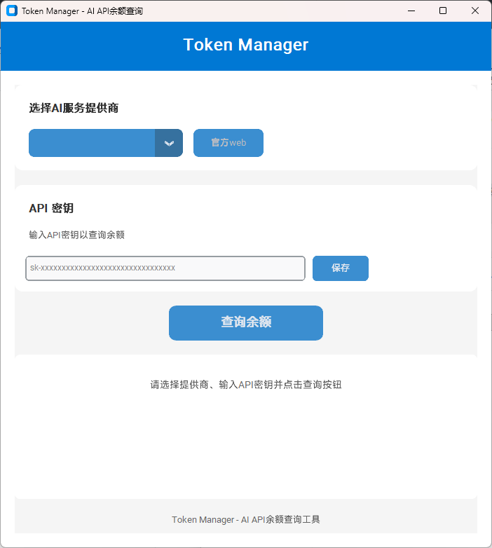

# TokenManager
## 产品预览

## ✨ 功能

- 查询Token余额
- 支持Deepseek
- 支持OpenAI

## 🚀 快速开始

### 方式1: 直接使用EXE（推荐）

[Releases](https://github.com/ZhuLinsen/daily_stock_analysis/releases)中下载最新exe文件，双击打开使用。

### 方式2: 使用.bat启动项目

双击使用launch.bat，启动项目GUI界面，需要电脑安装python环境。

使用此方式保存的API会在本地生成一个.XX_key用于保存对应服务商的API，如.deepseek_key。

## ⚠️ 免责声明

本项目仅供学习和研究使用，作者不对使用本项目产生的任何损失负责。

