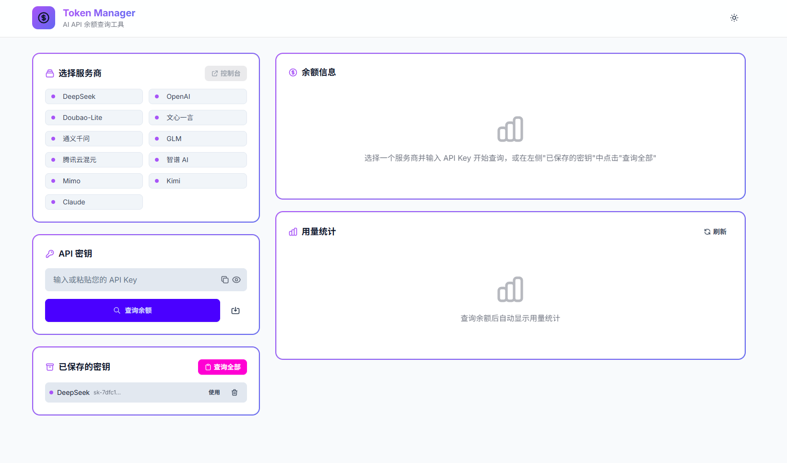

# TokenManager
## 产品预览

## ✨ 更新预览

增加多个AI服务商，更新GUI

## ✨ 功能

- 查询token余额、一键查询所有余额
- 支持用量统计（官方API提供）
- 支持保存、删除和复制token（保存在本地.XX_key文件中）
- 支持deepseek
- 支持openai
- 支持doubao
- 支持qwen
- 支持glm
- 支持hunyuan
- 支持zhipu
- 支持mimo
- 支持kimi
- 支持claude

## 🚀 快速开始

### 方式1: 直接使用EXE（推荐）

[Releases](https://github.com/shengyexiuyo/TokenManager/releases)中下载最新zip文件，解压后双击start.bat打开使用，双击stop.bat停止项目。

### 方式2: 使用.bat启动项目

双击使用“启动.bat”，启动项目GUI界面，需要电脑安装python环境。

使用此方式保存的API会在本地生成一个.XX_key用于保存对应服务商的API，如.deepseek_key。

## ⚠️ 免责声明

本项目仅供学习和研究使用，作者不对使用本项目产生的任何损失负责。

