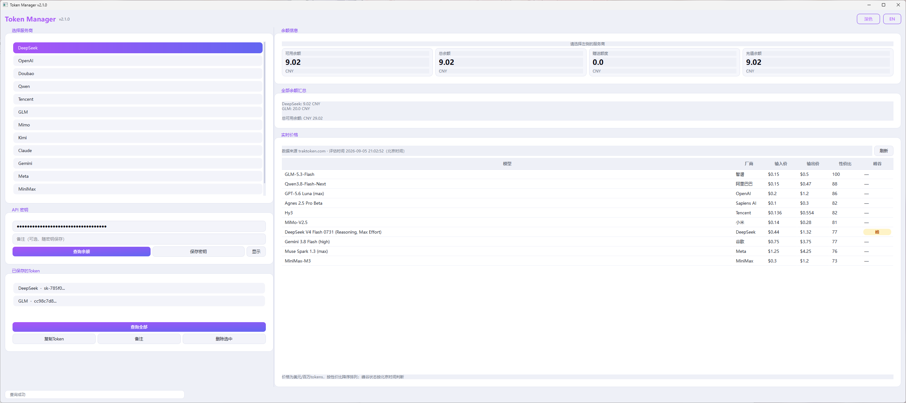

# TokenManager
## 产品预览



## ✨ 更新预览

v2.1：多Token管理（同一服务商可保存多个）、Token一键复制与备注、traktoken实时价格表（含峰谷时段）、深浅主题与中英双语、界面迁移为PySide6原生应用

## ✨ 功能

- 查询token余额、一键查询所有余额
- 支持用量统计（官方API提供）
- 多Token管理：同一服务商可保存多个Token，支持一键复制与备注（保存在本地.XX_key与.tokens.json）
- 支持自定义服务商（OpenAI兼容中转站，列表最后一栏为新增入口；可添加多个，支持修改和删除）
- 实时价格：右侧最后一栏展示 traktoken.com 价格表（按性价比降序），并为存在峰谷定价的服务商（如 DeepSeek）标明当前是峰还是谷时段
- 界面中英文双语，默认中文，右上角 EN/中文 一键切换
- 深色/浅色主题一键切换，偏好自动保存
- 支持deepseek
- 支持openai
- 支持doubao
- 支持qwen
- 支持tencent（腾讯混元）
- 支持glm（智谱）
- 支持mimo
- 支持kimi
- 支持claude
- 支持gemini（Google不提供余额API，仅验证Key有效性并显示可用模型数）
- 支持meta（同上，仅验证Key有效性）
- 支持minimax（同上，仅验证Key有效性）

## 🚀 快速开始

### 方式1: 直接使用EXE（推荐）

[Releases](https://github.com/shengyexiuyo/TokenManager/releases)中下载最新zip文件，解压后**双击 TokenManager.exe** 直接运行。这是一个纯原生桌面应用（PySide6/Qt）：无浏览器、无后端服务、无需安装python，界面与网页版功能一致（含自定义服务商增删改、实时价格表、中英双语）。密钥保存在exe同目录的.XX_key文件中，关闭窗口即退出。

### 方式2: 源码运行（开发模式）

```
pip install PySide6
python desktop.py
```

直接打开原生窗口，密钥保存在项目目录的.XX_key文件中。修改代码后用 build.bat 重新打包exe。

## 📁 数据说明

- 密钥与备注：保存在程序目录的`.XX_key`文件与`.tokens.json`
- 旧版本的单密钥文件会在首次运行时自动迁移，无需手动处理
- 实时价格来自 traktoken.com，本地缓存10分钟

## ⚠️ 免责声明

本项目仅供学习和研究使用，作者不对使用本项目产生的任何损失负责。

